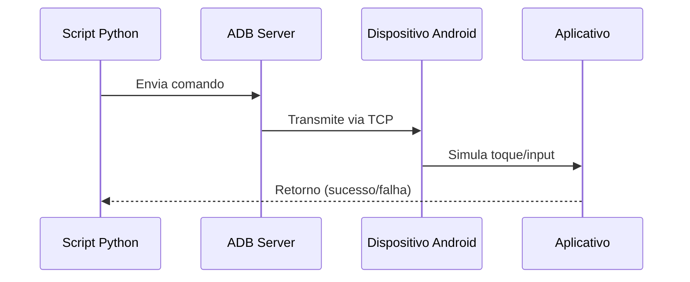

# [Introdução](https://github.com/ficayzx/Checker-satellite-android-adb)
- Objetivo do algoritmo:
     é automatizar á verificação de Contas de usuários, caso esteje disponiveis ou não

    - A solução é sistematica:
    Usa-se uma comunicação de **Android Debug Bridge (ADB)** o framework utilizado:
    > uiautomator2
    
    proporciona funções que contém a capacidade de chamar o comando de entrada e enviar a instrução para o evento de toque/clique do smartphone, simulando um comportamento voluntario

# Arquitetura
A arquitetura é composta pelos seguintes componentes:

# Requisitos
- Python 3.10+
- Termux
- Depuração Wi-Fi habilitada com permissão

```bash
git clone https://github.com/ficayzx/Checker-satellite-android-adb

cd Checker-satellite-android-adb

python main.py
```

> [!WARNING]
> Não se responsabilizo por qualquer dano usando o codigo.

   [](https://mvnrepository.com/artifact/com.google.android.uiautomator/uiautomator)

# Contribuições
[walker](https://github.com/ficayzx/)
